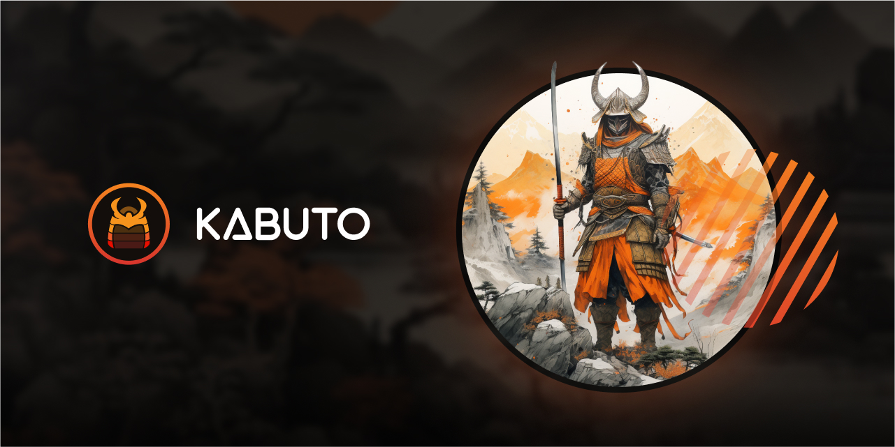

## Welcome to the Kabuto family

Kabuto was started as a community-driven suite of tools and services to support the Web3 community.

Most notibly, the Kabuto suite includes or has included:

* **[Kabuto Name Service (KNS)](https://ns.kabuto.sh/)**: The only 100% smart contract name service on Hedera. [Claim your name on KNS >>>](https://ns.kabuto.sh/)
* **Kabuto Faucet**: (coming soon) A service for developers to quickly get HBAR and USDC on Testnet.
* **Kabuto Mirror Node**: (paused) The original mirror node for Hedera.
* **Kabuto Explorer**: (paused) The original explorer for Hedera.

## Kabuto Governance

We believe that for tools and services to be valuable to the community, they need to involve the community in development and governance.

Kabuto projects are governed with [Kabuto Action Proposals (KAP)](https://github.com/kabuto-sh/proposals). These proposals are published as a mechanism for inviting public comment and review.